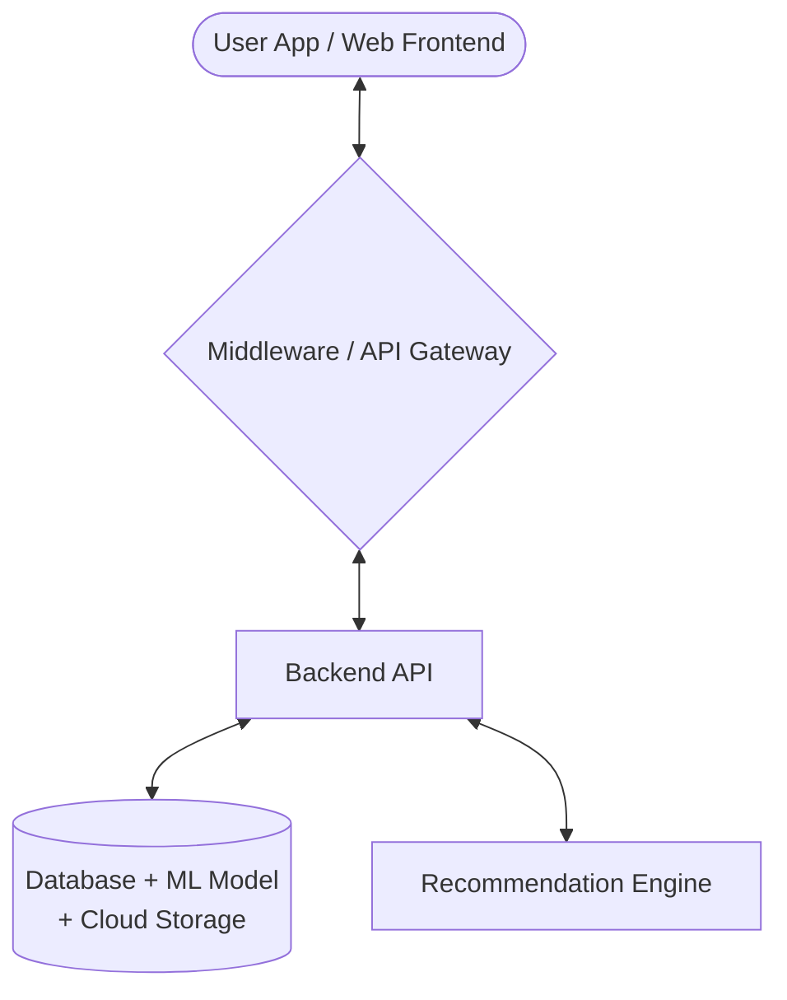
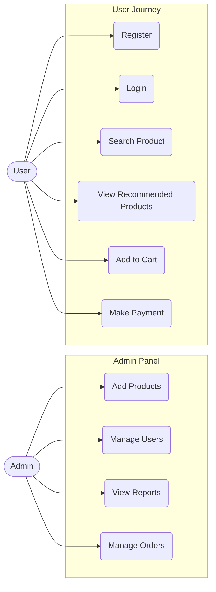
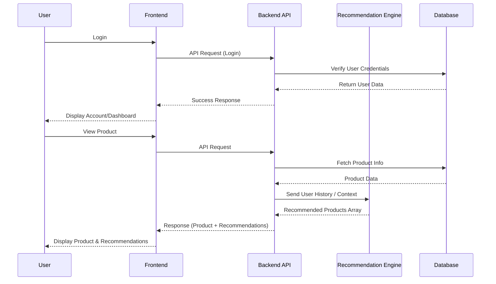
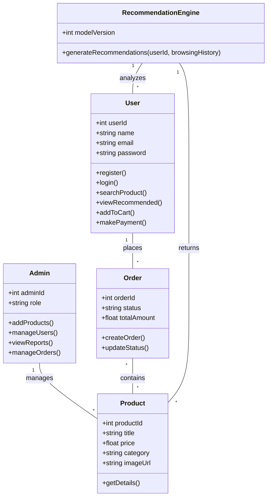

# AI-Based Product Recommendation System

## 1. System Architecture
The system architecture defines the high-level structure and components of our platform and their interactions:

## 2. Unified Modeling Language (UML) - Use Cases

### Actors
* **User**: The end-consumer browsing and purchasing products.
* **Admin**: The platform administrator who manages the system.

## 3. Sequence Diagram (Login & View Products)

## 4. Class Diagram

*(Note: Based on your provided UML Actors and actions, here is a foundational class structure that connects the entities)*

